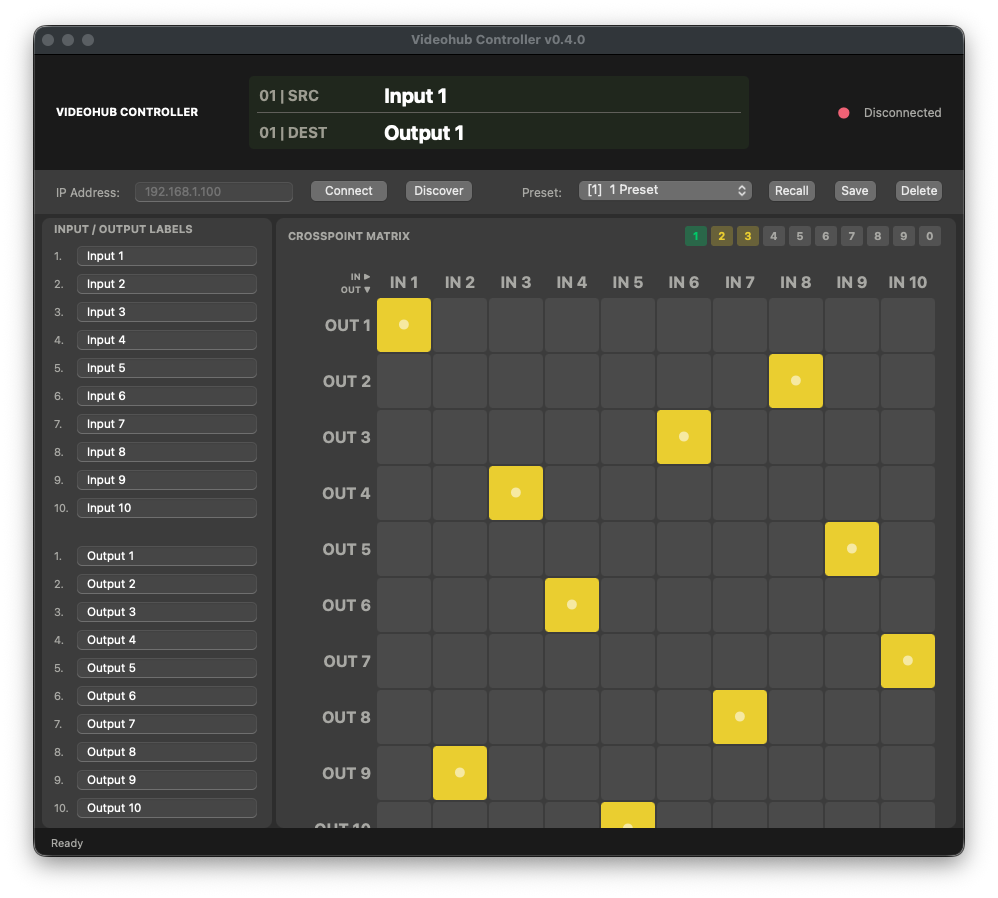

# Videohub Controller

[](https://github.com/chadlittlepage/VideohubController/actions)

Native macOS routing control application for Blackmagic Videohub SDI routers. Supports all models from Mini 4x2 to 80x80 with dynamic I/O sizing, a crosspoint matrix GUI, editable labels, routing presets with hotkey recall, Bonjour device discovery, and a hardware-style LCD display.

## Features

- **All Videohub models** -- dynamic I/O from Mini 4x2 up to 80x80 (6,400 crosspoints); GUI rebuilds automatically when you switch models
- **Hardware-style LCD display** -- simulated display in the title bar shows source/destination labels, hover position in yellow, and preset name on recall
- **Crosspoint matrix** -- click any cell to route an input to an output instantly; yellow crosshair guides follow your cursor; scrollable for grids larger than 12x12
- **Bonjour discovery** -- click Discover to find Videohubs on your local network via mDNS; auto-fills the IP and connects
- **Auto-connect on launch** -- reconnects to the last used IP automatically with no clicks needed
- **Bidirectional hardware sync** -- routes set in the GUI update the hardware; changes made on the front panel are reflected back in real time
- **Editable labels** -- rename any input or output; names are sent to the Videohub when connected and persist across restarts
- **Preset (salvo) save and recall** -- snapshot the full routing table to disk, then recall with a single click or hotkey; presets are model-specific
- **Preset rename** -- right-click or Control-click the preset dropdown to rename a preset in place; hotkey bindings are preserved
- **Hotkey presets (1-0)** -- assign up to 10 presets to keyboard keys for instant one-touch recall; click the number indicators or press the key
- **Three-state hotkey indicators** -- grey (unassigned), yellow (assigned), green (active) number badges show hotkey status at a glance
- **Global hotkeys** -- keys 1-0 work even when the app is not focused (requires Accessibility permission)
- **Keep on Top** -- float the window above other apps like DaVinci Resolve
- **Device model selection** -- choose your Videohub model in Settings or let the app auto-detect from hardware on connect
- **Per-model sessions** -- each device model saves its own routing, labels, presets, font sizes, and hotkey bindings independently; switching models restores exactly where you left off
- **Export/Import settings** -- save all configuration as JSON to transfer between machines or back up your setup
- **Settings panel (Cmd+,)** -- live font-size sliders for LCD, labels, and grid headers; device model dropdown; hotkey assignments; Keep on Top and Global Hotkeys toggles; Reset per-model
- **Console logging** -- all events are captured to a timestamped log file with automatic rotation; export via Help menu for remote debugging
- **Full session persistence** -- IP, labels, routing, presets, font sizes, hotkey bindings, LCD state, and device model are all saved on quit and restored on launch
- **Resizable and full screen** -- dark native Cocoa GUI; Cmd+F for full screen
- **In-app manual** -- full user guide accessible from the Help menu

## Requirements

| Requirement | Minimum |
|---|---|
| macOS | 14.0 (Sonoma) or later |
| Hardware | Any Blackmagic Videohub on the same network |

No Python installation required for the signed .app bundle.

## Installation

### Signed .app bundle (recommended)

Download the latest DMG from [Releases](https://github.com/chadlittlepage/VideohubController/releases), open it, and drag Videohub Controller to Applications.

The app is code-signed with Developer ID, notarized by Apple, and stapled for offline Gatekeeper validation.

### Development mode

```bash
git clone https://github.com/chadlittlepage/VideohubController.git
cd VideohubController
pip3 install -e .
videohub-controller
```

Requires Python 3.12+ and PyObjC.

### Build from source

```bash
pip3 install py2app
# Move pyproject.toml aside temporarily
mv pyproject.toml pyproject.toml.bak
ln -s src/videohub_controller videohub_controller
python3 setup.py py2app
mv pyproject.toml.bak pyproject.toml
rm videohub_controller
```

Output: `dist/Videohub Controller.app`

## Usage

### Connect

1. Launch Videohub Controller.
2. Click **Discover** to find Videohubs on your network automatically, or enter the IP address manually.
3. Click **Connect**. The matrix and labels populate from the hardware's current state.
4. The app auto-connects on launch if a saved IP exists.

### Device model

Open **Settings** (Cmd+,) and choose your Videohub model:

| Model | I/O |
|---|---|
| Auto-Detect | Detects from hardware on connect |
| Videohub Mini 4x2 12G | 4 in / 2 out |
| Videohub Mini 6x2 12G | 6 in / 2 out |
| Videohub Mini 8x4 12G | 8 in / 4 out |
| Videohub 10x10 12G | 10 in / 10 out |
| Smart Videohub CleanSwitch 12x12 | 12 in / 12 out |
| Videohub 20x20 12G | 20 in / 20 out |
| Videohub 40x40 12G | 40 in / 40 out |
| Videohub 80x80 12G | 80 in / 80 out |

The entire GUI rebuilds dynamically when you change models. The model selection persists across restarts.

### Route

Click any cell in the matrix. A yellow dot marks the active route for each output row. Crosshair guides follow your cursor. The LCD display shows the source and destination labels.

For grids larger than 10x10, headers show numbers only. Grids larger than 12x12 are scrollable.

### Rename labels

Click a label field, type a new name, and press Return. The name is sent to the Videohub when connected and updates the LCD immediately.

For models over 10 I/O, labels appear in two columns (inputs left, outputs right) with a scrollable panel.

### Presets

- **Save** -- click Save and enter a name
- **Recall** -- select from the dropdown and click Recall, or use a hotkey
- **Delete** -- select and click Delete; confirms before deleting
- **Rename** -- right-click (or Control-click) the preset dropdown and click "Rename..."

Presets are model-specific: only presets saved for the current I/O size appear in the dropdown.

### Hotkey presets

Assign presets to keys 1-9 and 0 in Settings. Press the key or click the indicator badge. Enable **Global Hotkeys** in Settings so keys work even when the app is not focused (requires Accessibility permission).

Indicator states: **grey** (unassigned), **yellow** (assigned), **green** (active).

### Settings (Cmd+,)

- **Device Model** -- select your Videohub model; GUI rebuilds dynamically
- **Font Sizes** -- LCD display, input/output labels, grid headers (saved per-model)
- **Keep on Top** -- float above other apps
- **Global Hotkeys** -- keys 1-0 work when app is not focused
- **Hotkey Presets** -- assign presets to keys 1-0
- **Reset This Device Model** -- erases labels, presets, and hotkey bindings for the current model only

### Export / Import

- **Export Settings** (Shift+Cmd+E) -- save all config as JSON
- **Import Settings** (Shift+Cmd+I) -- load config from JSON

## Keyboard Shortcuts

| Shortcut | Action |
|---|---|
| Cmd+Q | Quit |
| Cmd+H | Hide |
| Cmd+F | Toggle full screen |
| Cmd+, | Open/close Settings |
| Escape | Close Settings / cancel discovery |
| Shift+Cmd+E | Export Settings |
| Shift+Cmd+I | Import Settings |
| Cmd+C/V/X/A | Copy, paste, cut, select all |
| 1-9, 0 | Recall hotkey preset |
| Return/Enter | Confirm label rename |
| Tab | Next label field |
| Right-click | Rename selected preset |

## Troubleshooting

**Can't connect**
- Click Discover to find devices via Bonjour
- Verify the Videohub is powered on and on the network
- The app retries 3 times automatically

**"No route to host" after app update**
- macOS 15 may invalidate Local Network permission after re-signing. The app opens System Settings automatically. Toggle Videohub Controller OFF then ON.

**Hotkeys not working**
- Click the grid to deactivate text fields
- For Global Hotkeys: grant Accessibility permission in System Settings > Privacy & Security > Accessibility

**"Items had to be skipped" when installing**
- Dragging to /Applications requires an admin account
- Or drag to ~/Applications or Desktop instead

**Large grid (40x40, 80x80) is slow**
- Switching models takes a few seconds for large grids
- Use full screen (Cmd+F) for more space

## Videohub Protocol

Communicates over the Blackmagic Videohub Ethernet Protocol on TCP port 9990. Fully bidirectional. Compatible with Blackmagic Videohub Software, Smart Control, and third-party automation systems. Multiple clients can connect simultaneously.

## Tech Stack

| Component | Technology |
|---|---|
| Language | Python 3.12+ |
| GUI framework | PyObjC / AppKit (native Cocoa) |
| Graphics | Quartz CGColor, CATransaction batching |
| Discovery | NSNetServiceBrowser (Bonjour/mDNS) |
| Bundling | py2app |
| Distribution | Developer ID signed, Apple notarized, stapled DMG |
| Networking | Raw TCP sockets, threaded receive loop |

## File Locations

| Path | Contents |
|---|---|
| `/Users/Shared/Videohub Controller/videohub_controller.json` | All settings, presets, session state (shared by all users) |
| `~/Library/Application Support/Videohub Controller/logs/console.log` | Current session log |
| `~/Library/Application Support/Videohub Controller/logs/console.log.old` | Previous archived log |

Logs auto-rotate after 30 days or when the file exceeds 10 MB.

## Project Structure

```
VideohubController/
  src/videohub_controller/
    __init__.py          Package version
    app.py               Main Cocoa GUI and AppController
    connection.py        TCP connection manager and Bonjour discovery
    presets.py           Preset save/recall and per-model session persistence
    settings_window.py   Settings panel (model, fonts, hotkeys, toggles)
    console_log.py       Tee stdout/stderr to timestamped log file
    manual_window.py     In-app manual window
    about_window.py      About window with background image overlay
  assets/
    AppIcon.icns         Application icon
    about_background.jpg About window background
  app_entry.py           Entry point for py2app bundle
  setup.py               py2app build configuration
  pyproject.toml         Package metadata and dependencies
  entitlements.plist     macOS entitlements for distribution
```

## Author

**Chad Littlepage**
chad.littlepage@gmail.com
323.974.0444

## License

MIT
