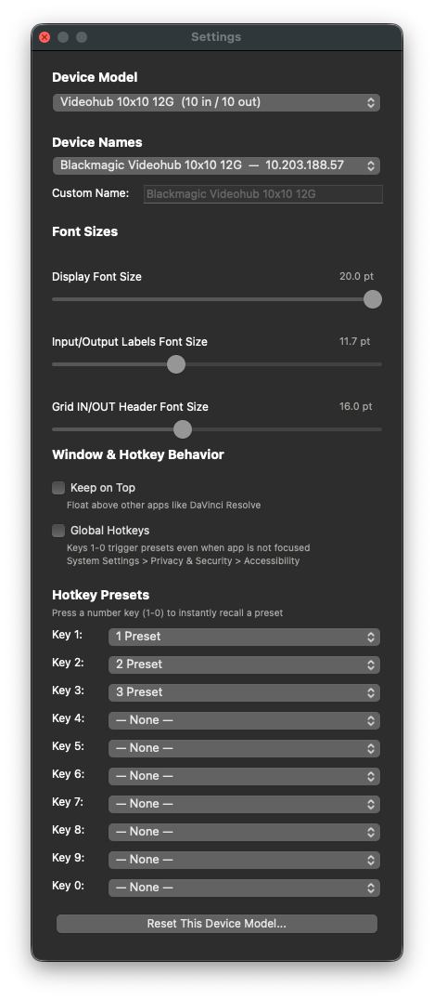

<p align="center">
  
  <br>
  
</p>

# Videohub Controller

[](https://github.com/chadlittlepage/VideohubController/actions)

Native macOS routing control application for Blackmagic Videohub SDI routers. Supports all models from Mini 4x2 to 80x80 with automatic discovery, multi-device management, per-device presets, custom device naming, and a hardware-style LCD display.

## Features

- **All Videohub models** -- dynamic I/O from Mini 4x2 up to 80x80 (6,400 crosspoints); GUI rebuilds automatically when you switch models
- **Auto-discovery on every interface** -- Bonjour browse on launch finds Videohubs across your LAN and direct-connected (link-local 169.254/16) interfaces; discovered devices persist across quit/relaunch
- **No Local Network permission needed for Bonjour-discovered devices** -- connections to discovered Videohubs flow through Apple's brokered NSNetService streams, bypassing the macOS 15+ per-user Local Network permission gate. Standard (non-admin) users can install and use the app without granting any extra permissions
- **Multi-device management** -- Device dropdown in the toolbar lists all known Videohubs; switch between devices with one click; each device saves its own config independently
- **Custom device names** -- right-click the Device dropdown or use Settings to give each Videohub a custom name (e.g., "Edit Suite A"); names persist across restarts
- **Per-device storage** -- presets, hotkey bindings, labels, font sizes, and session state are stored per hardware Unique ID; two identical models get separate configs
- **Hardware-style LCD display** -- simulated display in the title bar shows source/destination labels, hover position in yellow, and preset name on recall
- **Crosspoint matrix** -- click any cell to route an input to an output instantly; yellow crosshair guides follow your cursor; scrollable for grids larger than 12x12
- **Bonjour + ARP + port scan discovery** -- Discover runs the full Bonjour window (no early cutoff), then probes ARP-known neighbors and parallel-scans port 9990 on local subnets to catch direct-connected and non-Bonjour devices
- **Bidirectional hardware sync** -- routes set in the GUI update the hardware; changes made on the front panel are reflected back in real time
- **Editable labels** -- rename any input or output; names are sent to the Videohub when connected and persist per-device across restarts
- **Preset (salvo) save and recall** -- snapshot the full routing table to disk, then recall with a single click or hotkey; presets are per-device
- **Preset rename** -- right-click or Control-click the preset dropdown to rename a preset in place; hotkey bindings are preserved
- **Hotkey presets (1-0)** -- assign up to 10 presets to keyboard keys for instant one-touch recall; click the number indicators or press the key
- **Three-state hotkey indicators** -- grey (unassigned), yellow (assigned), green (active) number badges show hotkey status at a glance
- **Global hotkeys** -- keys 1-0 work even when the app is not focused (requires Accessibility permission); dialog guides you through setup
- **Keep on Top** -- float the window above other apps like DaVinci Resolve
- **Device model auto-detect** -- model detected from hardware on connect; Settings dropdown updates automatically
- **Export/Import settings** -- save all configuration (including all devices) as JSON to transfer between machines
- **Settings panel (Cmd+,)** -- device model, device names, font-size sliders, hotkey assignments, Keep on Top, Global Hotkeys, Reset per-model
- **Console logging** -- every action logged with timestamps for remote debugging; export via Help menu
- **Live Settings sync** -- Settings panel stays open across device switches and preset save/rename/delete; Device Names dropdown, Custom Name field, hotkey assignments, model dropdown and font sliders all update in place to follow the active device
- **Window size persistence** -- window size and position remembered across restarts
- **Full session persistence** -- every change writes to disk immediately (settings widgets, label edits, matrix clicks, preset ops, discovery results); state restored per-device on launch
- **Resizable and full screen** -- dark native Cocoa GUI; Cmd+F for full screen
- **In-app manual** -- full user guide accessible from the Help menu

## Requirements

| Requirement | Minimum |
|---|---|
| macOS | 14.0 (Sonoma) or later |
| Hardware | Any Blackmagic Videohub on the same network |

No Python installation required for the signed .app bundle.

## Installation

### Signed .app bundle (recommended)

Download the latest DMG from [Releases](https://github.com/chadlittlepage/VideohubController/releases), open it, drag to Applications. Code-signed, Apple notarized, and stapled.

### Development mode

```bash
git clone https://github.com/chadlittlepage/VideohubController.git
cd VideohubController
pip3 install -e .
videohub-controller
```

Requires Python 3.12+ and PyObjC.

### Build from source

```bash
pip3 install py2app
mv pyproject.toml pyproject.toml.bak
ln -s src/videohub_controller videohub_controller
python3 setup.py py2app
mv pyproject.toml.bak pyproject.toml
rm videohub_controller
```

Output: `dist/Videohub Controller.app`

## Usage

### Connect

1. Launch Videohub Controller.
2. The app automatically discovers Videohubs via Bonjour and connects.
3. If multiple devices are found, select one from the Device dropdown.
4. Or enter an IP manually and click Connect.

### Multiple devices

The Device dropdown in the toolbar shows all known Videohubs. Switch between devices with one click. Each device's presets, labels, hotkeys, and settings are stored independently.

Right-click the Device dropdown to rename a device (e.g., "Edit Suite A"). Custom names also editable in Settings > Device Names.

### Device model

The model is auto-detected from hardware on connect. You can also manually select a model in Settings (Cmd+,):

| Model | I/O |
|---|---|
| Auto-Detect | Detects from hardware on connect |
| Videohub Mini 4x2 12G | 4 in / 2 out |
| Videohub Mini 6x2 12G | 6 in / 2 out |
| Videohub Mini 8x4 12G | 8 in / 4 out |
| Videohub 10x10 12G | 10 in / 10 out |
| Smart Videohub CleanSwitch 12x12 | 12 in / 12 out |
| Videohub 20x20 12G | 20 in / 20 out |
| Videohub 40x40 12G | 40 in / 40 out |
| Videohub 80x80 12G | 80 in / 80 out |

### Route

Click any cell in the matrix. A yellow dot marks the active route for each output row. Crosshair guides follow your cursor. The LCD display shows the source and destination labels.

### Rename labels

Click a label field, type a new name, and press Return. The name is sent to the Videohub when connected and updates the LCD immediately.

### Presets

- **Save** -- click Save and enter a name
- **Recall** -- select from the dropdown and click Recall, or use a hotkey
- **Delete** -- select and click Delete; confirms before deleting
- **Rename** -- right-click (or Control-click) the preset dropdown and click "Rename..."

Presets are per-device: each Videohub has its own set of presets.

### Hotkey presets

Assign presets to keys 1-9 and 0 in Settings. Press the key or click the indicator badge. Enable **Global Hotkeys** in Settings so keys work even when the app is not focused (requires Accessibility permission).

### Settings (Cmd+,)

- **Device Model** -- select your Videohub model; auto-detected from hardware
- **Device Names** -- dropdown of all known devices; type a Custom Name for the selected device
- **Font Sizes** -- LCD display, input/output labels, grid headers (saved per-device)
- **Keep on Top** -- float above other apps
- **Global Hotkeys** -- keys 1-0 work when app is not focused
- **Hotkey Presets** -- assign presets to keys 1-0
- **Reset This Device Model** -- erases labels, presets, and hotkey bindings for the current model only

### Export / Import

- **Export Settings** (Shift+Cmd+E) -- save all config as JSON (includes all devices)
- **Import Settings** (Shift+Cmd+I) -- load config from JSON

## Keyboard Shortcuts

| Shortcut | Action |
|---|---|
| Cmd+Q | Quit |
| Cmd+H | Hide |
| Cmd+F | Toggle full screen |
| Cmd+, | Open/close Settings |
| Escape | Close Settings / cancel discovery |
| Shift+Cmd+E | Export Settings |
| Shift+Cmd+I | Import Settings |
| Cmd+C/V/X/A | Copy, paste, cut, select all |
| 1-9, 0 | Recall hotkey preset |
| Return/Enter | Confirm label rename / device name |
| Tab | Next label field |
| Right-click | Rename (on preset or device dropdown) |

## Troubleshooting

**Can't connect**
- The app auto-discovers via Bonjour on launch
- Click Discover for a deeper search (port scan fallback)
- Verify the Videohub is powered on and on the network
- The app retries 3 times automatically

**"No route to host" when connecting to a manually-typed IP**
- Bonjour-discovered devices connect through Apple's brokered NSNetService path and don't need any extra permission.
- Manually-typed IPs use a raw TCP socket, which on macOS 15+ requires per-user Local Network permission. Either:
  - Use Discover instead — it'll find the device and connect via the brokered path, no permission needed.
  - Or grant the permission once: System Settings → Privacy & Security → Local Network → toggle "Videohub Controller" ON. The app triggers a LAN ping at launch so the entry appears in the list before you click Connect.

**Hotkeys not working**
- Click the grid to deactivate text fields
- For Global Hotkeys: grant Accessibility permission in System Settings > Privacy & Security > Accessibility

**Multiple devices**
- All discovered devices appear in the Device dropdown
- The last-used device is auto-selected on launch
- Each device is identified by its hardware Unique ID

**"Items had to be skipped" / "Videohub Controller can't be opened"**
- Make sure you have the latest DMG from Releases. Some earlier DMGs shipped an unstapled .app — macOS 15 Gatekeeper rejects those without a network round-trip.
- If you already have a half-installed copy, drag `/Applications/Videohub Controller.app` to the Trash and reinstall from a fresh download.
- Quit any running copy of Videohub Controller before dragging a new one over the existing install.

## Videohub Protocol

Communicates over the Blackmagic Videohub Ethernet Protocol on TCP port 9990. Fully bidirectional. Compatible with Blackmagic Videohub Software, Smart Control, and third-party automation systems. Multiple clients can connect simultaneously.

## Tech Stack

| Component | Technology |
|---|---|
| Language | Python 3.12+ |
| GUI framework | PyObjC / AppKit (native Cocoa) |
| Graphics | Quartz CGColor, CATransaction batching |
| Discovery | NSNetServiceBrowser (Bonjour/mDNS), port scan fallback |
| Bundling | py2app |
| Distribution | Developer ID signed, Apple notarized, stapled DMG |
| Networking | Raw TCP sockets, threaded receive loop |

## File Locations

| Path | Contents |
|---|---|
| `/Users/Shared/Videohub Controller/videohub_controller.json` | All settings, presets, device configs, session state (shared by all users) |
| `~/Library/Application Support/Videohub Controller/logs/console.log` | Current session log |
| `~/Library/Application Support/Videohub Controller/logs/console.log.old` | Previous archived log |

Logs auto-rotate after 30 days or when the file exceeds 10 MB.

## Project Structure

```
VideohubController/
  src/videohub_controller/
    __init__.py          Package version
    app.py               Main Cocoa GUI and AppController
    connection.py        TCP connection manager, Bonjour discovery, port scan
    presets.py           Preset save/recall, per-device session persistence
    settings_window.py   Settings panel (model, device names, fonts, hotkeys)
    console_log.py       Tee stdout/stderr to timestamped log file
    manual_window.py     In-app manual window
    about_window.py      About window with background image overlay
  assets/
    AppIcon.icns         Application icon
    about_background.jpg About window background
  app_entry.py           Entry point for py2app bundle
  setup.py               py2app build configuration
  pyproject.toml         Package metadata and dependencies
  entitlements.plist     macOS entitlements for distribution
```

## Author

**Chad Littlepage**
chad.littlepage@gmail.com
323.974.0444

## License

MIT
